# All-In-One Project Management System

# Architecture
Backend: Laravel 7.x RESTful / MySQL

Frontend: React.js / Redux Saga / Kadiri template

## Feature
User Management

Client Invite and SubDomain Assignment

Project Management

Task Management

People Management

Setting

## Screenshots
Dashboard
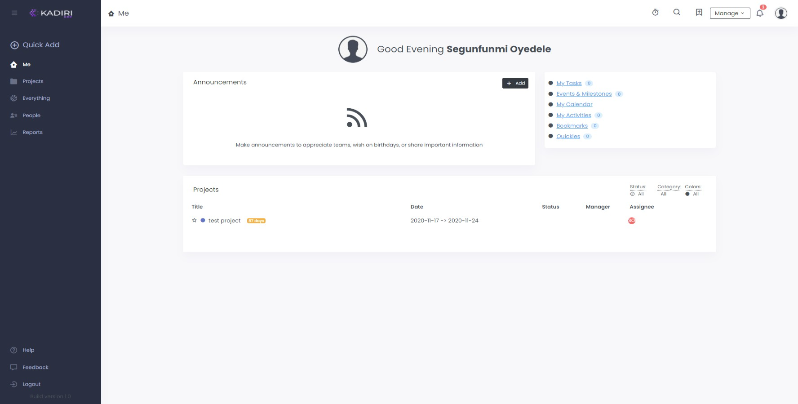

All projects
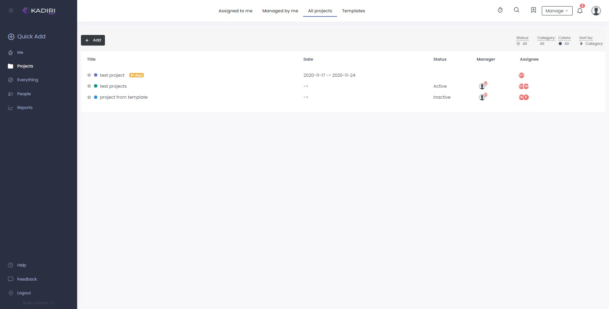

All tasks
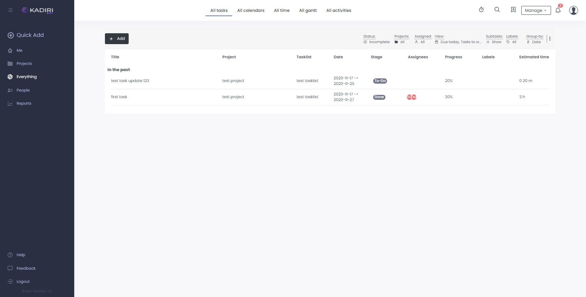

All Activities
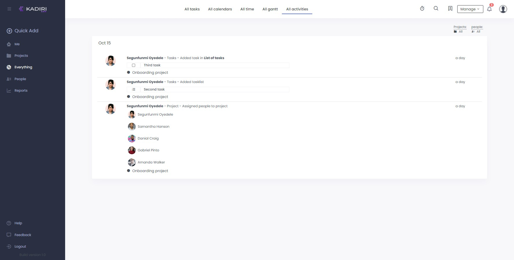

People
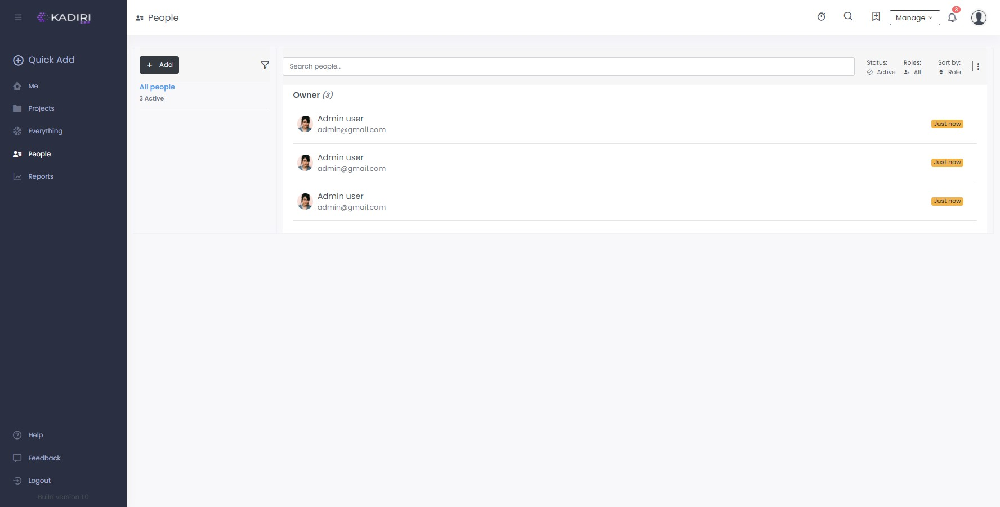

Project overview
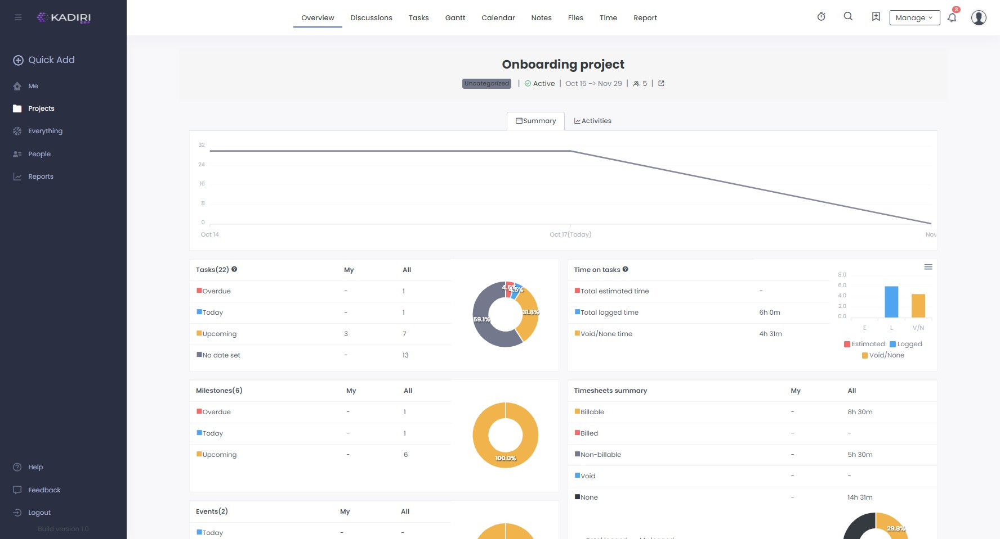

Discussion
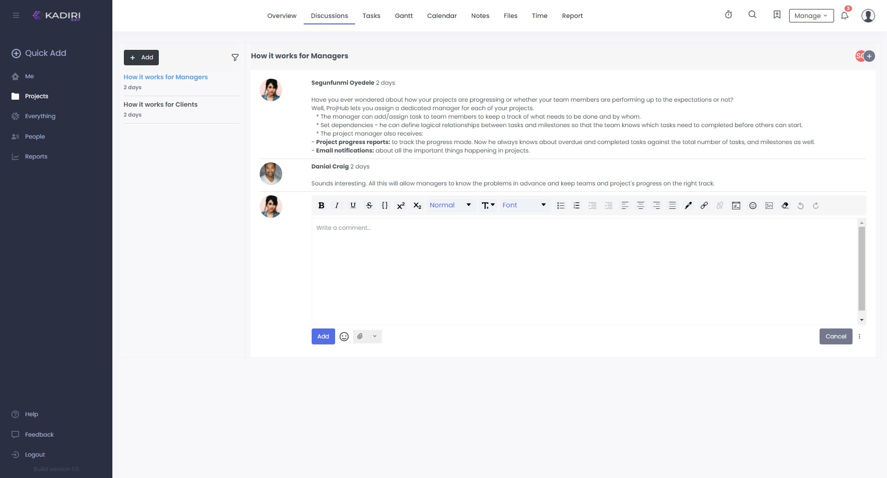

Project tasks
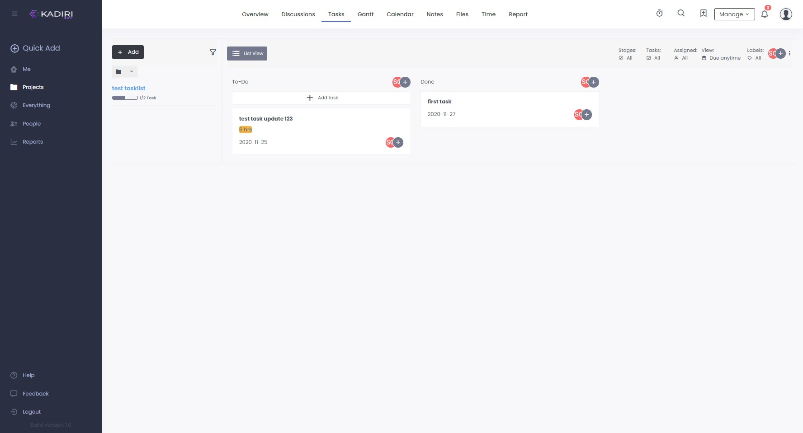

Files
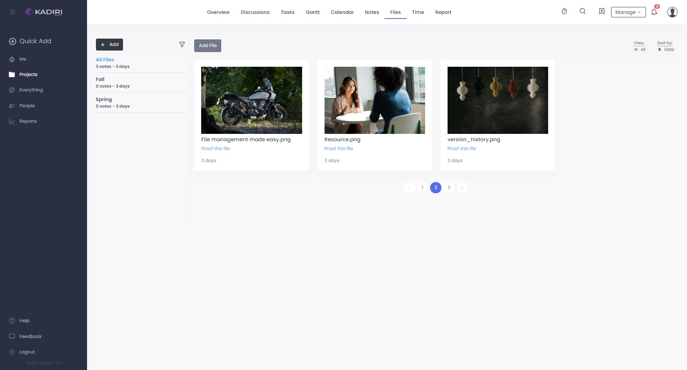

Gantt
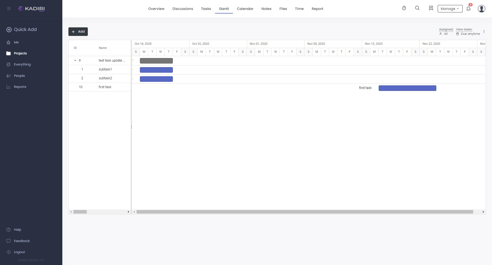

Note
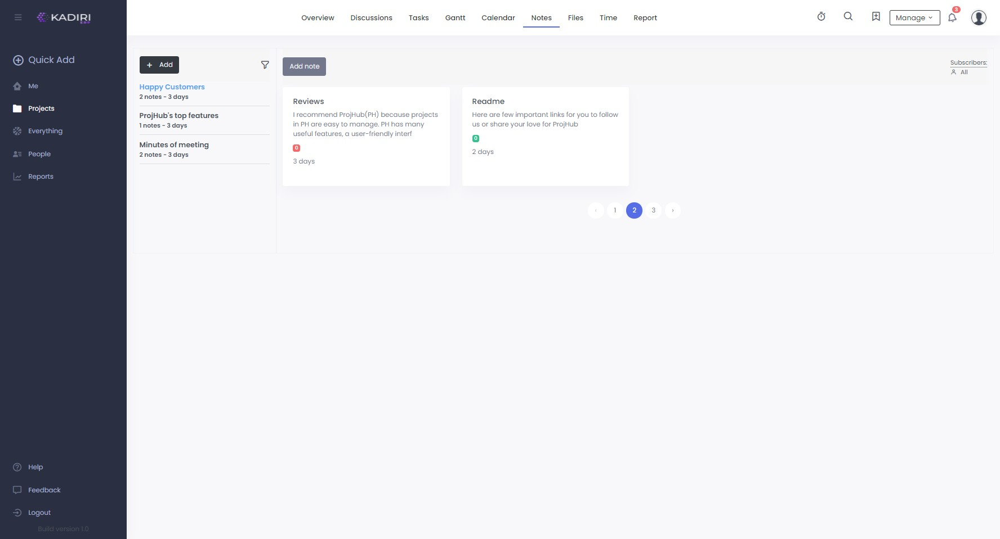

Time logs
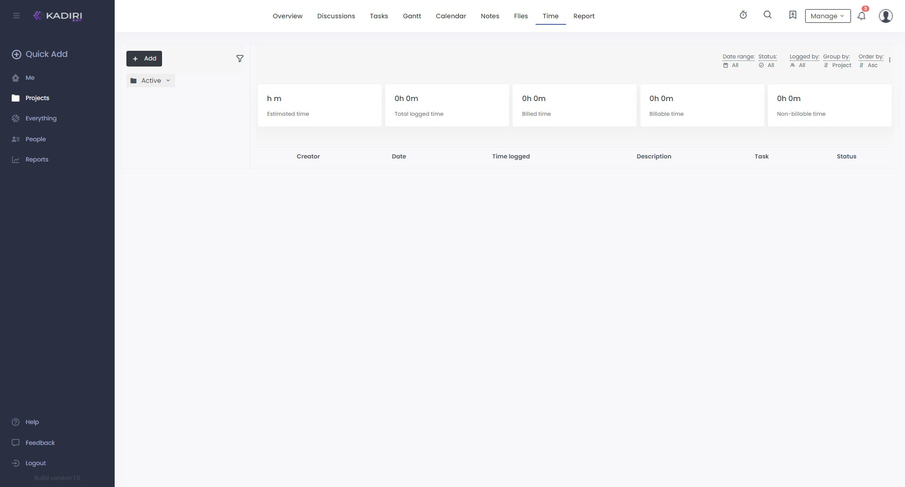

